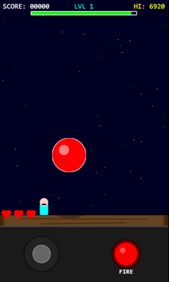

# pan-clone-game
Implementación del juego arcade clásico "Pang" (también conocido  como Buster Bros) usando Phaser 3.

# Acceso al juego

Para acceder al juego, pincha aquí: [Pang Clone Game](https://jmmluna.github.io/pang-clone-game/dist)

# Stack tecnológico
- Bun
- Phaser 3
- TypeScript
- Vite

